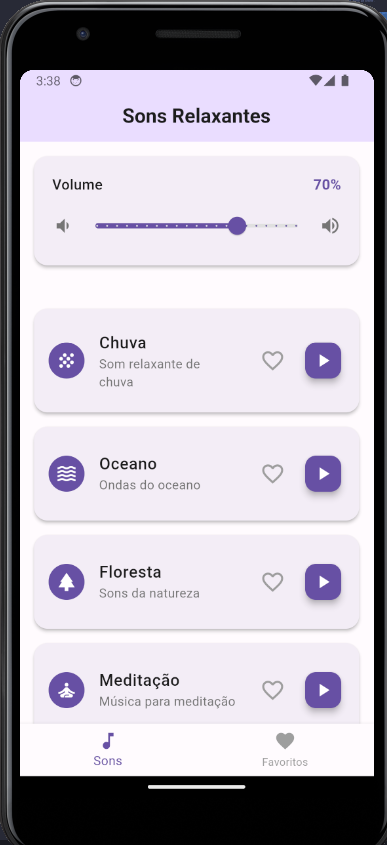
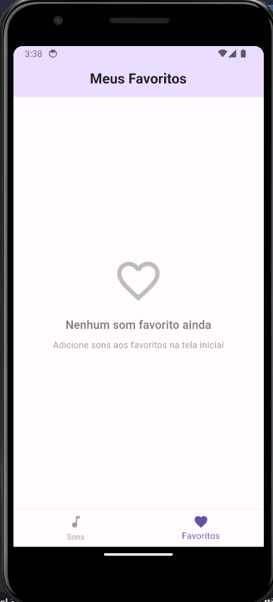

# relaxing_sounds_app

Aplicativo Flutter para reprodução de sons relaxantes, com opção de favoritos. 

## Descrição

Este projeto foi desenvolvido como atividade para praticar Flutter. O app permite ao usuário ouvir sons relaxantes (chuva, oceano, floresta, meditação), ajustar o volume e marcar seus sons favoritos para fácil acesso.

## Observações

- Use APENAS o arquivo `chuva.ogg` para o som.

## Funcionalidades

- Lista de sons relaxantes com ícones e descrição
- Controle de volume integrado
- Reprodução contínua (loop)
- Marcar/desmarcar sons como favoritos
- Tela dedicada para favoritos

## Screenshots

### Tela Inicial




### Tela de Favoritos




## Como executar

1. Clone este repositório
2. Instale as dependências:
   ```
   flutter pub get
   ```
3. Execute o app:
   ```
   flutter run
   ```

## Recursos utilizados

- [Flutter](https://flutter.dev/)
- [Provider](https://pub.dev/packages/provider)
- [audioplayers](https://pub.dev/packages/audioplayers)
- [shared_preferences](https://pub.dev/packages/shared_preferences)

## Observações

- OBS: VERIFICAR O PATH SE ESTA CORRETO!!!
- Os arquivos de áudio devem estar na pasta `assets/sounds/`.
- Lembre-se de adicionar os assets no `pubspec.yaml`.


